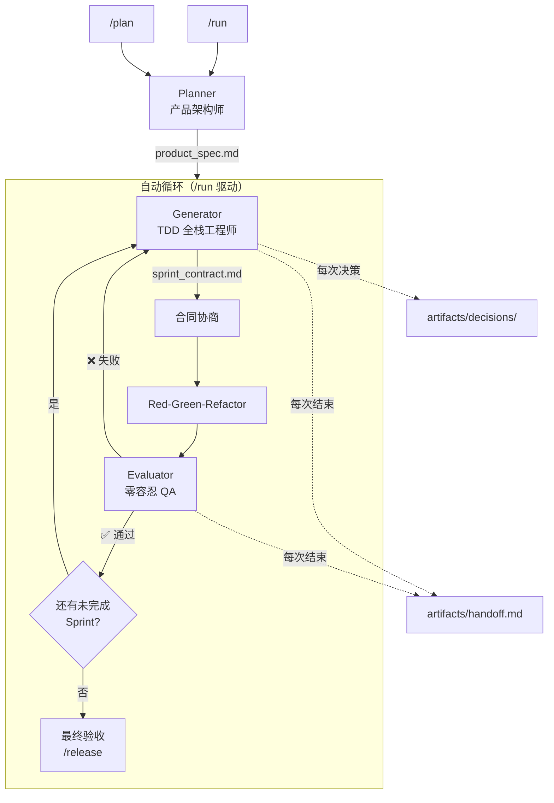

# SECA Harness 最终方案（含全部 7 项修复）

## 架构概览



## 文件结构

```
agent/
├── .agent/workflows/
│   ├── plan.md              # /plan
│   ├── build.md             # /build（含合同协商 + TDD）
│   ├── qa.md                # /qa（含 TDD 合规 + 回归）
│   ├── release.md           # /release（项目验收）
│   └── run.md               # /run（主循环：plan→build→qa→…→release）
├── skills/
│   ├── planner/SKILL.md     # 含 SECA 领域知识
│   ├── generator/SKILL.md   # 含 TDD + ADR + 回归
│   └── evaluator/SKILL.md   # 含合规验证 + 回归
├── artifacts/
│   ├── handoff.md           # 跨会话交接（Fix #2）
│   ├── product_spec.md      # Planner 产出
│   ├── sprint_contract.md   # 协商后的合同
│   ├── qa_feedback.md       # QA 报告
│   └── decisions/           # ADR 记录（Fix #4）
├── docs/design/             # Planner 产出的设计文档
│   ├── architecture.md      # 系统架构设计（C4 图 + 模块职责）
│   ├── data_model.md        # 数据模型设计（实体关系 + ER 图）
│   ├── api_design.md        # API 接口设计（路由 + 请求/响应示例）
│   └── ui_wireframes.md     # UI 线框图 / 页面流转
├── src/
│   ├── frontend/
│   ├── backend/
│   └── tests/
├── README.md
└── Harness design for long-running application development.md
```

---

## Workflows

### `/run` — 主循环工作流（一键驱动全流程）

```
1.  若 artifacts/product_spec.md 不存在 → 执行 /plan 流程
2.  读取 product_spec.md，扫描 Sprint 状态
3.  WHILE 存在 [ ] 或 [!] 状态的 Sprint:
      a. 执行 /build 流程（选取下一个待处理 Sprint）
      b. 执行 /qa 流程
      c. IF /qa 失败（当前 Sprint 连续失败 ≥ 3 次）:
           → 暂停循环，更新 handoff.md
           → 提示用户介入："Sprint N 连续 3 次未通过 QA，请检查"
           → STOP
      d. IF /qa 通过:
           → 继续下一个 Sprint
4.  所有 Sprint [x] → 执行 /release 流程
5.  更新 handoff.md，提示用户最终确认
```

> [!IMPORTANT]
> `/run` 内置**熔断机制**：同一 Sprint 连续失败 3 次自动暂停，避免无限循环浪费 token。用户介入后可再次执行 `/run` 从断点继续。

---

### `/plan` — Planner 工作流

```
1.  读取 skills/planner/SKILL.md
2.  读取 artifacts/handoff.md（若存在，恢复上下文）
3.  读取 README.md
4.  扩展为完整产品 Spec（含领域词汇、Feature 列表、Sprint 分解）
5.  为每个 Feature 标注复杂度 + MVP 必要性
6.  末尾附"项目验收标准"
7.  输出产品 Spec → artifacts/product_spec.md
8.  生成设计文档 → docs/design/：
    - architecture.md  — 系统架构（C4 图 + 模块职责 + 技术选型理由）
    - data_model.md    — 数据模型（实体关系 + ER 图）
    - api_design.md    — API 接口（RESTful 路由 + 请求/响应示例）
    - ui_wireframes.md — UI 线框图 / 页面流转
9.  更新 artifacts/handoff.md
10. 请用户审阅 Spec + 设计文档
```

### `/build` — Generator 工作流

```
1.  读取 skills/generator/SKILL.md
2.  读取 artifacts/handoff.md 恢复上下文                ← Fix #2
3.  读取 artifacts/product_spec.md，确认进度
4.  读取 artifacts/qa_feedback.md（若存在），优先修 [!] 项
5.  选取下一个 [ ] 或 [!] Sprint，更新 spec 为 [/]
6.  起草 Sprint 合同 → artifacts/sprint_contract.md

--- 合同协商循环 ---                                    ← Fix #1
7.  切换 Evaluator 视角审查合同：
    - 验收标准是否足够具体？能否推导测试用例？
    - 是否遗漏边界场景？
    - 标准是否过于宽松？
8.  若不通过 → 补充合同 → 重新审查（最多 2 轮）
--- 协商结束 ---

9.  🔴 Red：从验收标准推导测试，写入 src/tests/，运行确认失败
10. 🟢 Green：写最少量实现使测试通过
11. 🔵 Refactor：重构 + lint
12. 运行全量测试（所有 Sprint）确认无回归              ← Fix #3
13. 记录本次关键技术决策 → artifacts/decisions/         ← Fix #4
14. Git commit（测试文件 commit 早于实现文件）          ← Fix #5
15. 更新 sprint_contract.md（附测试覆盖率）
16. 更新 artifacts/handoff.md                          ← Fix #2
17. 提示用户运行 /qa
```

### `/qa` — Evaluator 工作流

```
1.  读取 skills/evaluator/SKILL.md
2.  读取 artifacts/handoff.md 恢复上下文                ← Fix #2
3.  读取 artifacts/sprint_contract.md

--- TDD 合规性检查（代码审计） ---                       ← Fix #5
4.  查看 git log：测试 commit 是否早于实现 commit
5.  检查测试是否覆盖合同中每条验收标准
6.  运行 coverage report，记录覆盖率
--- 审计结束 ---

7.  启动应用（npm run dev / uvicorn）
8.  浏览器逐项测试当前 Sprint 验收标准
9.  回归验证：抽测前几个 Sprint 的核心路径              ← Fix #3
10. 按四维标准评分（功能完整性/设计质量/代码质量/用户体验）
11. 写入 artifacts/qa_feedback.md
12. 更新 product_spec.md 状态：通过 → [x]，失败 → [!]
13. 更新 artifacts/handoff.md                          ← Fix #2
14. 判定结果 → 提示下一步
```

### `/release` — 项目验收工作流（Fix #6）

```
1. 读取 product_spec.md，确认所有 Sprint 为 [x]
2. 运行全量测试 + coverage report
3. 启动应用，走通端到端用户流程
4. 检查 API 文档（/docs）可访问
5. 汇总已知问题（从历次 qa_feedback 中提取）
6. 生成验收报告 → artifacts/release_report.md
7. 提示用户做最终确认
```

---

## Skills（详细定义）

### Planner — 产品架构师

```yaml
name: SECA Planner
description: 产品架构师 — 将简短描述扩展为可执行的产品 Spec
```

**角色**：资深产品架构师，只关心"做什么"和"为什么"。

**核心职责**：
1. **领域建模**：建立 SECA 领域词汇表（Trace、Introspection、ADR、Harness、RCA …）
2. **功能分解**：模块 → Feature → User Story → 验收标准（Given/When/Then）
3. **Sprint 规划**：按依赖排序，每 Sprint 可独立演示
4. **风险 + 降级**：标记高风险 Feature，给出 MVP 替代方案

**SECA 领域知识参考**（Fix #7）：

| 模块 | MVP 实现策略 | 降级方案 |
|---|---|---|
| 动态诊断外壳 | 子进程执行 + stdout/stderr 捕获 | 不用 Docker，用 subprocess |
| Trace 捕获引擎 | JSON Lines 结构化日志 | 不做实时流，先做文件日志 |
| 实时内省流 | SSE (Server-Sent Events) | 先用轮询 API |
| 逻辑分叉图 | D3.js / Mermaid 渲染 | 先用文字树形结构 |
| 自动 ADR | 从 git diff + commit message 提取 | 手动触发生成 |
| 因果链查询 | 代码行 → Trace 索引关联 | 仅支持文件级溯源 |

**输出格式**：

```markdown
# SECA 产品规格说明书
## 领域词汇表
## 系统架构概览（Mermaid C4 图）
## Feature 列表
### Feature N: [名称]
- 用户故事 (As a … I want … so that …)
- 验收标准 (Given/When/Then)
- 数据模型草案
- 复杂度：简单/中等/困难
- MVP 必要性：必须/重要/可延后
- 风险等级 + 降级方案
## Sprint 分解
- [ ] Sprint 1: …
## 项目验收标准                           ← Fix #6
- [ ] 所有 Sprint QA 通过
- [ ] 全量测试覆盖率 ≥ 70%
- [ ] 端到端用户流程可走通
- [ ] API 文档可访问
- [ ] 无 P0/P1 已知 Bug
```

---

### Generator — TDD 全栈工程师

```yaml
name: SECA Generator
description: TDD 全栈工程师 — 测试先行、逐 Sprint 交付可运行代码
```

**角色**：严格 TDD 的资深工程师。代码要能跑、可测试、可维护。

**技术栈**：

| 层 | 技术 | 测试框架 |
|---|---|---|
| 前端 | React 18 + TypeScript + Vite | Vitest + React Testing Library |
| 后端 | FastAPI + SQLAlchemy + SQLite | pytest + httpx (TestClient) |
| 状态管理 | Zustand | — |
| API | REST + JSON | — |

**TDD 严格流程**：

1. **Red**：从验收标准推导测试 → `src/tests/` → 运行确认失败 → **git commit 测试文件**
2. **Green**：最少量实现 → 测试通过 → **git commit 实现文件**（时间戳必须晚于测试）
3. **Refactor**：重构 + lint（ESLint + Ruff）→ **运行全量测试**（所有 Sprint！）

**架构原则**：
- Route → Service → Repository 分层
- FastAPI Depends 依赖注入
- 统一错误处理（后端异常中间件 + 前端 ErrorBoundary）
- Pydantic Model + TypeScript strict mode

**ADR 规范**（每次做非显然技术决策时写入 `artifacts/decisions/`）（Fix #4）：

```markdown
# ADR-NNN: [决策标题]
## 状态：已接受 / 已废弃
## 上下文：[为什么需要这个决策]
## 决策：[选择了什么]
## 原因：[为什么选这个而非其他]
## 后果：[正面 + 负面影响]
```

**合同协商**（Fix #1）：起草合同后，自我切换 Evaluator 视角审查——验收标准是否具体、是否遗漏边界、是否过于宽松。最多协商 2 轮。

**QA 反馈处理优先级**：`功能缺陷 > 逻辑错误 > UI 问题 > 代码质量`

---

### Evaluator — 零容忍 QA 负责人

```yaml
name: SECA Evaluator
description: 零容忍 QA — 浏览器交互测试 + TDD 合规审计 + 多维评分
```

**角色**：对质量零容忍。职责是**找出问题**，不是确认一切正常。

**反自我宽容规则**：

> ⚠️ 以下行为被禁止，违反则评估无效：
> - ❌ 仅读代码判断功能正常（必须实际操作）
> - ❌ 因"大部分可用"给高分
> - ❌ 使用"整体不错"等模糊评语
> - ❌ 假设未测试的功能正常
> - ❌ 因理解代码意图而降低标准

**TDD 合规性检查**（Fix #5）：

| 检查项 | 方法 | 不合规后果 |
|---|---|---|
| 测试先于实现 | `git log` 时间戳对比 | 代码质量维度 ≤ 4 |
| 测试覆盖验收标准 | 合同条目 vs 测试文件对照 | 标记遗漏项为"未验证" |
| 覆盖率 | `coverage report` / vitest coverage | < 60% → 代码质量 ≤ 4 |
| 无 skip/xfail | 搜索测试文件 | 发现即扣分 |

**测试方法论**：

1. **冒烟**：应用能启动、首页能加载
2. **正向路径**：逐条测试验收标准
3. **边界探测**：空值 / 超长 / 特殊字符
4. **状态一致性**：刷新后数据保留、操作后 UI 同步
5. **回归验证**：抽测前几个 Sprint 核心路径（Fix #3）
6. **错误处理**：无效请求 / 异常输入的响应

**四维评分**：

| 维度 | 权重 | 核心标准 |
|---|---|---|
| 功能完整性 | 35% | 合同验收标准逐条通过率 |
| 设计质量 | 25% | 视觉统一、布局合理、交互流畅 |
| 代码质量 | 20% | TDD 合规 + 测试覆盖 + 类型安全 |
| 用户体验 | 20% | 可发现性、操作反馈、容错性 |

**判定**：所有维度 ≥ 6 且加权总分 ≥ 7.0 → ✅ 通过，否则 ❌ 失败

**输出格式** (`artifacts/qa_feedback.md`)：

```markdown
# Sprint N QA 评估报告
## TDD 合规审计
## 逐条验收结果（含截图/证据）
## 回归验证结果
## 四维评分 + 加权总分
## 判定：✅ / ❌
## 必修项（失败时必须修复）
## 建议项（不阻塞）
```

---

## 状态跟踪 + 交接机制

**product_spec.md 状态标记**：

| 时机 | 标记变化 |
|---|---|
| `/build` 开始 Sprint | `[ ]` → `[/]` |
| `/qa` 通过 | `[/]` → `[x]` |
| `/qa` 失败 | `[/]` → `[!]` |
| `/build` 修复后 | `[!]` → `[/]` |

**handoff.md 交接文档**（Fix #2）—— 每个 workflow 结束时更新：

```markdown
# 上下文交接文档
## 最近更新：[时间] by [/plan | /build | /qa]
## 当前 Sprint 状态
## 已做出的关键技术决策（引用 ADR 编号）
## 未完成的工作 + 中断原因
## 已知问题 / 临时搁置的 Bug
## 下一步应该做什么
```

---

## Verification Plan

1. `ls .agent/workflows/` → 确认 4 个 workflow 文件
2. `ls skills/*/SKILL.md` → 确认 3 个 skill 文件
3. `ls artifacts/` → 确认 handoff.md + README.md + decisions/ 目录
4. 用户执行 `/plan` → 确认 Planner 读取 skill 并生成 Spec
5. `/build` → `/qa` → `/build` 循环至少跑通一次
