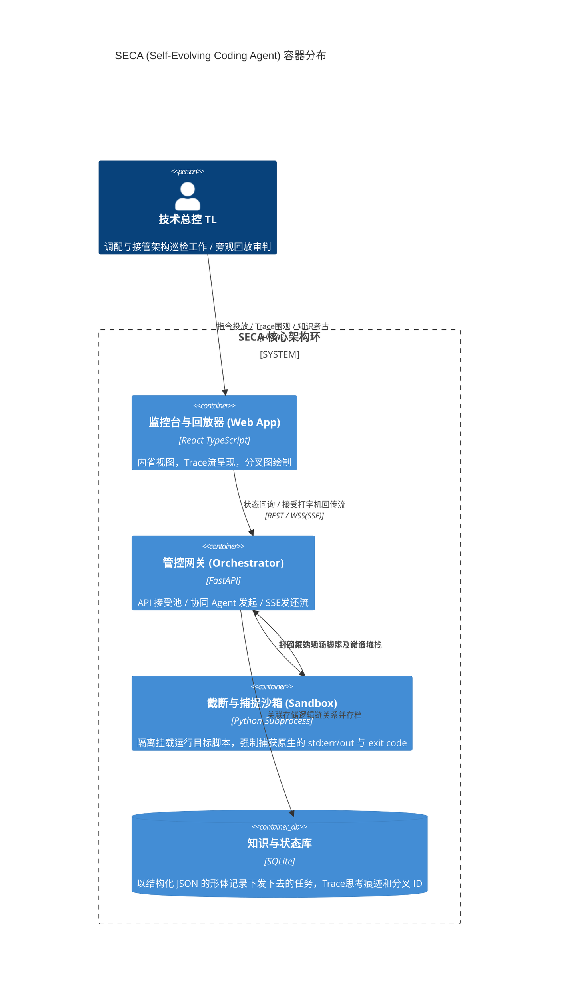

# SECA 系统架构设计

## 1. 架构目标
贯彻 "意图胜出代码" (Intent over Code) 的核心哲学。建立隔离观察室和全视监控台体系：以白盒形式将大型智能体进行沙盒控制与透视化。

## 2. 工具链硬选型
- **应用客户端 (Dashboard)**: React + Vite + TailwindCSS + Zustand 状态网。极致的 Hacker 风与现代毛玻璃（Glassmorphism）极简质感。
- **接入与流控核心 (Core API)**: FastAPI + Pydantic (Type Hints 保卫战)。选用强类型。
- **持久化记录底座 (State Storage)**: SQLModel + aiosqlite (首置 MVP 无痛本地方案，通过 ORM 为迁移 PostgreSQL 留后门)。
- **信令协议 (Communication)**: SSE (Server-Sent Events) 纯推流应用层；REST 接收。

## 3. C4 架构容器分布

## 4. 核心实现挑战及架构容忍度
MVP 版本最大的妥协：**沙箱防溢性**。Docker 级别的真物理隔离由于守护进程（Daemon）接管繁复并损耗 I/O 和计算等待，为保证轻量化迭代演进，前期全盘使用 Node/Python Subprocess 来实现包裹沙盒。这对恶意循环等系统调用具有一定妥协，但在目前为足够有效。
