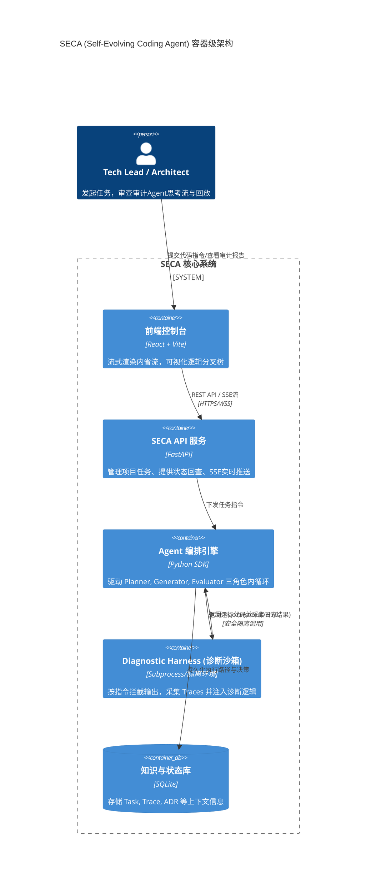

# SECA 系统架构设计

## 1. 架构目标
实现 README 中定义的 "Intent over Code" 理念，提供基于反馈诊断的智能体闭环。本架构明确分离**用户交互层**、**Agent编排控制层**、与**沙箱执行层**。

## 2. 核心技术选型
- **前端（User Interface）**: React 18, Vite, TailwindCSS (现代且高效地搭建拟态设计), Zustand (处理全局状态，特别适合实时通信日志的管理)。
- **后端（Orchestration & API）**: FastAPI (Python), SQLModel/SQLAlchemy (ORM层支持类型完整与异步能力)。
- **持久层**: SQLite (MVP 阶段), 结合 `aiosqlite` 保证非阻塞 IO，可平滑迁移至 PostgreSQL。
- **通信协议**: 数据读写采用 RESTful API，内省任务监控面板全部采用 Server-Sent Events (SSE) 单向推送提升性能。

## 3. C4 架构容器图 (Container Diagram)

## 4. 模块职责划分
- **API 层 / 路由层 `api_router`**: 负责处理鉴权、项目配置信息的 CRUD 和 SSE 流媒体推送池的管理。
- **编排层 `engine`**: 解析并下发 Agent 策略。包含重试/重构、提示词诊断优化循环；维护在长线程任务下的对话上下文长度处理方案。
- **沙箱/Harness 层 `sandbox`**: 提供统一的 `execute_code()` 核心接口。解析代码/Bash命令执行，无侵入式捕获退出码和异常栈，封装为固定结构体对象 `TraceResult` 供编排层做后续推理。
