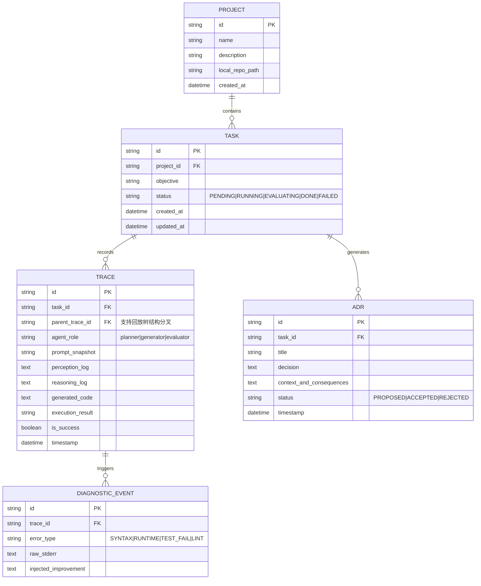

# SECA 数据模型设计

## 1. 实体关系概述

SECA 的核心业务对象围绕着**项目层级 (Project)**、**任务指令 (Task)** 和底层原子单位**执行轨迹 (Trace)** 构建，为后续复杂的错误根因回放及架构决策关联提供结构化基础。

## 2. 字段生命周期说明
- `TRACE.parent_trace_id` 构成了系统能以树状图形回溯展示（Post-mortem Playback）的基石。在试错中，每当产生代码错误并回退修正时，在此节点派生新的 trace 子节点即可。
- `DIAGNOSTIC_EVENT` 为动态元优化提供基础，该表统计了 Agent 跌倒重灾区错误情况，能供机器学习长期反馈分析（资本效率与诊断 ROI）。
