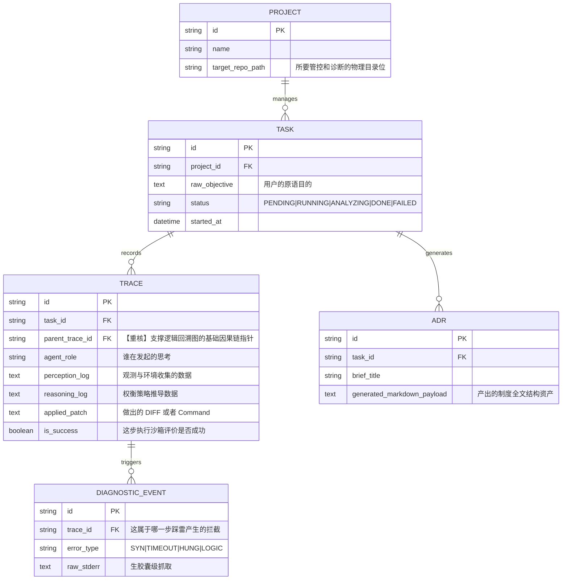

# SECA 数据模型体系设计

## 1. 全局图谱
一切根源追溯于 Task (一次指令执行)。而 Agent 与底层的攻防博弈将被细化碎片在 Trace 表级。

## 2. 数据字典流传点核说
- `TRACE.parent_trace_id`: 此处若为空则代表这步是从 Task根级开启的首层探讨。若尝试修 A bug 失败，Agent 退回到 A 节点前重新选择修 B，则它派生的子类也会同样以该父节点指向自己，实现 DAG 有向无环图关联，这是产品 Playback 回放流的心脏字段。
